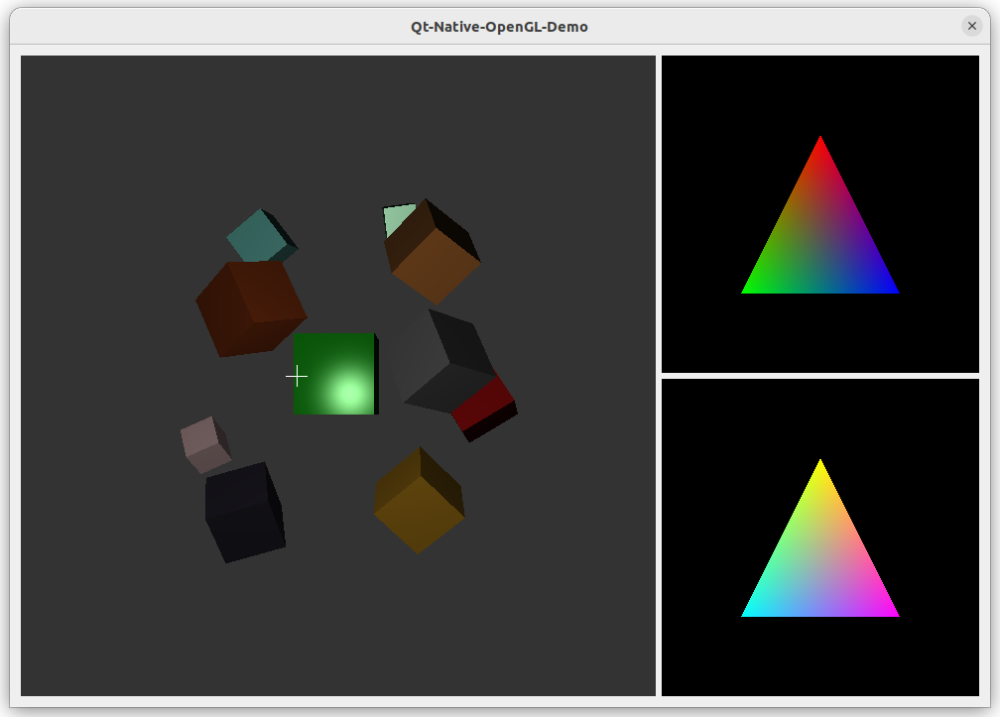

# Qt Native OpenGL Demo

这个项目展示了在 Qt 中使用原生 OpenGL 接口的方法，包含 GLAD、GLEW 和 EasyGL 的示例。



## Build - 构建

```
mkdir build
cmake .. -DCMAKE_BUILD_TYPE=Release
cmake --build . --config Release --parallel
```

> 由于 `GLEW` 的代码生成步骤只能在 POSIX 环境下进行，因此这个项目首次编译必须在 POSIX 环境下进行。  
> 进行过首次编译， `GLEW` 的代码生成后，这个项目可以在任意操作系统下编译。  
> 如果只能在 Windows 上编译，请从 [这里](https://sourceforge.net/projects/glew/files/glew/snapshots/) 下载 `GLEW` 的源码，覆盖 `thirdparty/glew`